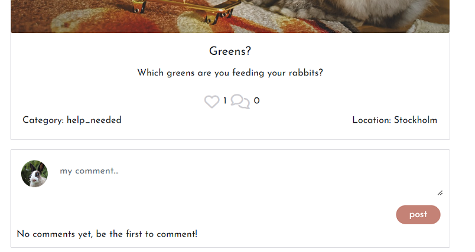

# **Welcome to Bunnyland**

Bunnyland is a social community for bunny interested people. The site should be inspiering and provide a site where users could register and interact with the community by adding posts, like posts, follow profiles, comment on posts and message other users. The community also provides a special site for adoption posts where users could post rabbits who needs a new home and seeking users who would like to adopt them. The site should be inviting, easy to navigate and inspiering for both rabbit owners and rabbit interested users. Since there are many rabbits who needs a new home due to different circumstances the site should also provide an easy way to find a new furry friend.

This fictional site was created for Portfolio Project #5 (Advanced Front End) - Diploma in Full Stack Software Development Diploma at the [Code Institute](https://www.codeinstitute.net). 

[View live website here](https://bunnyland.herokuapp.com/)

## Table of Contents

- [Project](<#project>)
    * [Objective](<#objective>)
    * [Site Users Goal](<#site-users-goal>)
    * [Site Owners Goal](<#site-owners-goal>)
    * [Project Management](<#project-management>)

- [User Experience (UX)](<#user-experience-ux>)
    * [Wireframes](<#wireframes>)
    * [User Stories](<#user-stories>)
    * [Site Structure](<#site-structure>)
    * [Design Choices](<#design-choices>)

- [Existing Features](#features)
  * [Navigation](#navigation)
  * [Authentication](#authentication)
  * [Homepage](#homepage)
  * [Adoption](#adoption)
  * [Feed](#feed)
  * [Create a Post](#create-a-post)
  * [Post Detail Page](#post-detail-page)
  * [Create an Adoptionpost](#create-an-adoptionpost)
  * [Adoptionpost Detail Page](#adoptionpost-detail-page)
  * [Profile Page](#profile-page)
  * [Reusable React Components](#reusable-react-components)

- [Features Left To Implement](<#features-left-to-implement>)

- [Technologies Used](<#technologies-used>)
    * [Languages](<#languages>)
    * [Frameworks & Software](<#frameworks--software>)
    * [Libraries](<#libraries>)
- [Agile Workflow](#agile-workflow)
  * [Github Project Board](#github-project-board)
- [Testing](#testing)
- [Deployment](#deployment)
- [Credits](#credits)

# **Project**

## Objective

The objective of this project is to build a community-based rabbit content sharing web application for rabbit owners/rabbit interested allowing users to learn, adopt and communicate. The platform allows users to view, create, edit, delete, like and comment postings and adoptionposts (placed on a separate adoption site, which is found in the navbar menu). On the adoptionposts the user can click an "Adoption request" button to fill in a form (with contact details) which is sent to the adoptionpost owner to notify interest in adopting the rabbit. The content can be viewed in a logical order, searched on by keywords. Users can also follow each other and register their interest in other user's shared content and also send a message to another user/correspond through the message function.

## Site User's Goal

There are primarily three types of users who will be interacting with this platform; rabbit owners, users interested in adopting a rabbit and users who would like to gain info about rabbits.

## Site Owner's Goal

As the site owner, I saw a need for a bunny comunity to share tips and info about rabbits. Since there are many rabbits who needs a new home due to different circumstances an important part of the site  should also be to provide an easy way to adopt a bunny.

## Project Management

### Github Project Board

I've been using the project board in GitHub to keep my project together. 

[User Stories](https://github.com/Karasp1980/bunnyland/issues)
[Project Board](https://github.com/users/Karasp1980/projects/9)

### Database Schema

All the models have been set up in a separate DRF repository. Click [here](https://github.com/Karasp1980/drf-backend) to view the repository or [here](bunnyland-drf.herokuapp.com) to view the deployed API. The database schema was created using dbdiagram [here](dbdiagram.io) and can be seen here:
[Database schema]((images/databaseschema.png))

 
[Back to top](<#table-of-contents>)

# **User Experience (UX)**

## Wireframes

The wireframes for the site were created using [Balsamiq](https://balsamiq.com). The wireframes have been created principally for desktop devices as this is a browser based platform. However, the wesbite is responsive for tablet and mobile, and I have created additional wireframes to show how the various events pages and profile page adapt to smaller devices. The main grid layout of the components is initially based on the CI Moments walkthrough tutorial as this seems to me the best layout both for wider desktops as for smaller mobile devices for a content sharing platform so I didn't see much reason to change it or find many areas where I could improve on it. Any differences are down to personalised content that fits the project goals.

<b>Wireframes</b>

 

## User Stories
Here I have listed the main user stories for a user who is not logged in, or has no account and a logged in user. These user stories were then tested and confirmed in the [Testing](<#testing>) section.

[User Stories](https://github.com/Karasp1980/bunnyland/issues)

[Back to top](<#table-of-contents>)

## Site Structure

Bunnyland is split up in two parts: when the user is logged out and when the user is logged in. Depending on login status different pages are available for the user. When the user is logged out the pages: Home, Adoption and Sign In or Up are available from the Navigation Bar menu. When the user is logged in Feed, Likes, Signout and Profile Page also become available. 

## Design Choices

* ### Color Scheme

When choosing the color scheme I choose  #A43F2D red as the primary color in navbar text and buttons etc and different shades of gray for the other text content. As I find white background nice to the red color and also wanted the post/adoptionposts to melt in well I kept the background color white.

* ### Typography

The main font used for the site is 'Lobster' with a fallback font of Sans-Serif just in case it doesn't load. This font is classic and nice and suites the design since the colors are kept simple. As for the text in the forms and posts 'Josefin Sans' with a fallback font of Sans-Serif was chosen since this font is nice and clear to read.

[Back to top](<#table-of-contents>)

# **Existing Features**

* ## Navigation

The navigation bar is very clean and straight forward. Depending on whether you are logged in or not, different menus are visible for the site user. For tablet and mobile devices, the navigation bar menu turns into a hamburger dropdown list. 

On accessing the site for the first time, the user is logged out and the following menu items are visible:

* Bunnyland logo - On the far left hand side of the navigatin bar is the Bunnyland brand logo. This is visible throughout the site to all user types and contains a link back to the homepage. 
* Home - the first menu item, and the initial default start page, is 'Home', where all posts are displayed. 
* Adoption - this site displays all adoption posts where users could wiew posts with rabbits that need new homes
* Authentication - Signin/Signup for not logged in users and Signout for logged in users 

Once the user logs in, additional links become available to select:

* Adoption - The adoption posts now also display an "Adoption request" button
* Feed - Logged in users can access the feed page where they can see posts of other profiles they follow.
* Likes - Logged in users can access all posts they have liked
* Authentication - Sign out. The icons within the authentication change once a user has logged in, and now displays a link to Sign out.
* Profile page - When logged in the user a link to the users own profile page is displayed on the right side of the page.
* Add Post - Logged in users can access the event creation page to share their own posts to the site. 
* Add Adoption post - Logged in users can access the adoption post creation page to share their own adoption posts to the site. 

## Authentication

Users who are new to the site, or haven't previously created an account can click on the Signup Menu option on the Navigation Bar to create a user account.  I have used the standard dj-rest/auth/registration user account signup process for this. 

If a user has a Bunnyland user account, they can click on the Signin menu option in the Navigation Bar to sign into their account.

If the user wishes to sign out, once signed in, the sign out option becomes visible in the Navigation Bar for them to select. 

* ## Homepage

There are four main react components which make up the Home events page. 

1. Popular Profiles Component
2. Posts
3. Search and Filter

### Popular Profiles Component

The popular profiles component is a permanent feature across the entire site. It appears at the top of all pages. This component uses a filter to order all site users by followers count from highest to lowest. The users with the highest follower count are determined to be the most popular profiles and the top six are displayed within the popular profiles component. 

If the user isn't logged in, they can see avatar, and the username of the top 6 most popular profiles, and if the user is logged in, they will also see a button enabling them to follow or unfollow the profile. 

Each profile avatar can be clicked on to view the full profile page of that user. 

### Posts

All posts that are created through the Bunnyland sharing platform are displayed on the Homepage. You create a post by clicking the "Add post" button in the navbar and fill in the form. All posts created are requested from the API and they are ordered by the created date starting with the most recently posted and working backwards. 

Each post displays the user who shared it and the date it was shared. In bold, you can see the post title and a description.

Underneath is a heart symbol for likes and the total number of likes (counts). The logged in user could like a post by clicking the heart and the heart then changes color to red. By clicking the heart again you could unlike the post. The post could then be found on the users "Liked" page (which is found in the navbar) so the user could easily find the post there. Next to the likes symbol there is a comments symbol and the total number of likes on the post.

Under is the category and location. The category could be "help_needed, "tip" or "other".

By clicking on the post image or the comments count, the user is taken to the posts details page.

### Adoption posts

The Adoption site is created the same way as for the posts. All adoption posts that are created through the Bunnyland sharing platform are displayed on the Homepage. You create a post by clicking the "Add adoption post" button in the navbar and fill in the form. All adoption posts created are requested from the API and they are ordered by the created date starting with the most recently posted and working backwards. 

The adoption posts are all the same as the posts with only a fiew differences; 

* Instead of category and location you have breed, location, sex and age in order for the users to more easily select a bunny to adopt. The sex could be female_spayed, female_unspayed, male_neutered, male_unneutered.

* Under the post is an "Adoption request" button, which is only displayed for logged in users. When clicking the button a modal opens with a form to fill in (name, phone, email, message) which is sent to the owner of the adoption request when clickin the submit button.3

### Search and Filter

 The user can search all the posts listed by post title, username who posted it, category, location or keyword in the content. The filter category could also be used for Posts (not adoption posts) to filter posts by category: Tip, Help needed, Other

* ## Feed

The feed page looks identical to the homepage, only the Posts component changes. In this page all the posts are requested from the API, but then a filter is used to only show posts by profiles that the currently logged in user is following. For this reason, this page doesn't work if the user is not logged in. Equally, if the user isn't following any other profiles, no posts will be displayed and a 'No Results found' message will appear instead inside the events posts component. 

* ## Create a Post

If you are logged in, you are able to share posts with the community. By clicking on the Add Post menu option in the Navigation Bar, you are taken to the Create post page, where you can submit the event creation form to the API.

 Once the form has been submitted successfully, you can see the post published successfully as you are re-directed automatically to the newly created post details page. 

Each time you share a new post with the community, your posts count goes up on your profile page for other users to see how active you are on the site. 

* ## Post Detail Page

In the post details page, this simply shows everything relating to one single post. You can reach this page by clicking on an post image on the post. It also shows the popular profiles component for continuity across the pages. If you are the owner of the post, from this page you have the option to edit or delete the event by clicking on the three dots that appear next to the posts posted date. 

If you select Edit, you are taken back to the post creation form, but the fields are already pre-populated with the existing event information. You can edit the desired fields and save the changes, which will return you to the post detail page and you can see that the post has been updated successfully. 

If you select Delete, the post will be removed from all pages and the user redirected back to the previously visited page. 

Below the Posts details is the comments section. If there are no comments yet, the user will see a message telling them that there are no comments. 

If the user is not logged in, they can read any comments that have been posted but they can't post a comment themselves unless they log in. 

Any comments that have been posted about this post are displayed, regardless of login status. If the user logs in they will see a comment form above the existing comments where they can post their own comments about the post for other users to read. 

* ## Create an Adoption post

If you are logged in, you are able to share Adoption posts with the community. By clicking on the Add Adoption post menu option in the Navigation Bar, you are taken to the Create Adoptionpost page, where you can submit the event creation form to the API.

 Once the form has been submitted successfully, you can see the post published successfully as you are re-directed automatically to the newly created event details page. 

* ## Adoptinpost Detail Page

In the Adoptionpost details page, this simply shows everything relating to one single post. You can reach this page by clicking on an adoptionpost image on the adoptoinpost. It also shows the popular profiles component for continuity across the pages. If you are the owner of the adoptionpost, from this page you have the option to edit or delete the event by clicking on the three dots that appear next to the posts posted date. 

If you select Edit, you are taken back to the post creation form, but the fields are already pre-populated with the existing event information. You can edit the desired fields and save the changes, which will return you to the post detail page and you can see that the post has been updated successfully. 

If you select Delete, the post will be removed from all pages and the user redirected back to the previously visited page just like on the Post Edit page.

Below the Adoptionpost details is the comments section working in the same way as on the Post details page. If there are no comments yet, the user will see a message telling them that there are no comments. 

If the user is not logged in, they can read any comments that have been posted but they can't post a comment themselves unless they log in. 
Any comments that have been posted about this post are displayed, regardless of login status. If the user logs in they will see a comment form above the existing comments where they can post their own comments about the post for other users to read. 

* ## Profile Page

Throughout the site, wherever you see profile avatars, albeit in the popular profiles component, or next to posts/adoption posts, comments that have been published, you can click on the avatar to view the full profile page of that user. In the Navigation Bar, in the authentication dropdown, you can access your own profile page as well.  

### Profile Stats

When a user signs up and creates a new site account, a basic profile is automatically created with a username, password and defauly avatar image. The only information that subsequently gets updated in the profile page is the site usage stats, as follows: 

* Number of posts the user has posted
* Number of adoption posts the user has posted
* Number of profiles they are following
* Number of profiles that are following them

There is an about container and a contact details container which remain empty until the user goes into their own profile page and clicks on the three dots dropdown to Edit the profile and add their personal details to the page. If they click on the Edit Profile option, they are taken to a new page containing the full profile details form to fill in and submit. Here, they can add their own avatar image, a name, bio. These are designed mainly to give posts hosts the opportunity to publish additional information but of course all users are welcome to add as much or little personal info as they wish. 

Once these fields have been filled in, they can be seen by other users in the main profile page stats container. 

Each profile also has a follow button inside the stats container so that other users can click it to follow and unfollow the profile as all profiles won't always appear listed in the popular profiles component, to access the follow functionality there. 

### Profile Posts

Below the profile stats you can see all the posts and adoptionposts posted by the profile you are viewing. Any of these can be clicked on to view the individual post detail page with comments if there are any. First all posts are displayed (in disending date order), and then all adoption posts (in disending date order). My plan is to improve this in the future to display the posts and adoption posts together (just sorted in disending date order) to make it easier for the users to find the post. This is somethin I am aware of and want to improve but leave for now due to time management.

### Messages

At the top right side of the Profile page there is a messaging system component. On desktop devices the message component is visible on the right of popular profiles, but for tablet and mobile it moves into place between the popular profiles and the User Profile Stats. 

If you are viewing someone else's profile, the message component contains a form to write a message and send it to the owner of the profile page you are viewing. 

If you are viewing your own profile page the messaging component will display your own private message inbox. Other users will not be able to see the messages that have not been sent to them. All messages that have been sent to you, are displayed in descending order of when they were sent. You can see the avatar and the username of the sender, the date the message was sent, and the message itself. Each message has a 'reply' button if the user wants to send a reply message back to the sender. 

Unlike with other forms such as creating an event, comment or review, where you can see the published content once the form has been posted successfully, the user does not have access to other user's inboxes to check whether the message has been sent successfully or not. For this reason, in the case of the messaging component, I have set up an alert system using Bootstrap alerts, to display a success alert message when a message or a reply message have been sent successfully. This adds to good user experience, and user peace of mind. 

Equally, if the user tries to send a blank message, they will see a Bootstrap warning message telling them that they must fill in the message field in order to send the message successfully. 

For the time being, there is no alert system in place to send a notification to a user when they receive a new message, but this is something I would like to look into in future development sprints.

### Adoption request

At the end of all adoption posts, there is an "Adoption request button". When clicked a modal opens with a form where you can add contact details (name, phone, email, message).

The adoption request then appears on the Profile page of the Adoption request owner. At the top right side of the Profile page under the Messages there is an Adoption request system component. On desktop devices the Adoption request component is visible on the right of popular profiles (under messages), but for tablet and mobile it moves into place between the popular profiles and the User Profile Stats. 

If you are viewing someone else's profile, no Adoption request field is visable. If you are viewing your own profile page the Adoption request component will display your own private Adoption request inbox. Other users will not be able to see the Adoption requests that have not been sent to them. All Adoption requests that have been sent to you, are displayed in descending order of when they were sent. You can see the avatar and the username of the sender, the date the message was sent, name, phone, email and a message. 

Unlike with other forms such as creating a post, adoption post or comment, where you can see the published content once the form has been posted successfully, the user does not have access to other user's inboxes to check whether the adoption request has been sent successfully or not. For this reason, in the case of the messaging component, I have set up an alert system using Bootstrap alerts, to display a success alert message when a message or a reply message have been sent successfully. This adds to good user experience, and user peace of mind. 

Equally, if the user tries to send a blank message, they will see a Bootstrap warning message telling them that they must fill in the fields in order to send the request successfully. 

For the time being, there is no alert system in place to send a notification to a user when they receive a new adoption request, but this is something I would like to look into in future development sprints.

* ## Reusable React Components

### Three Dots Edit Delete Dropdown Menu

Based on the Moments walkthrough project 'MoreDropdown' component, I have utilised the same idea in my project but extended it's use even further to be accessed when editing or deleting events, comments and also reviews. In addition to this re-usable component which I learnt from the course tutorials, I also developed four more custom re-usable components specifically for my project.

### Alert Component

As stated previously, there is no way for the user to check whether the message form has been submitted correctly or not, as the user doesn't have access to other user's inbox. I therefore wanted to set up a bootstrap success alert. Initially I created this as a single function inside the MessageCreateForm.js component. In a later sprint, when I was developing the reply feature, I decided to create a re-usable Alert component which could be used interchangeably between the send message and reply message forms. I refactored the code inside the MessageCreateForm component and imported the newly created AlertMessage component into the ReplyMessageForm.js component as well. 

# **Features Left to Implement**

* Add a notification system in to alert users when they receive a new message or Adoption request
* Add a reply mecanism to the Adoption request function so the user sending the request could get a yes or no on their request
* On the profile pages, get the posts and adoptionposts rendered together and in date order, now all posts are displayed first and then adoption posts
* Get the search filter by category on the PostsPage to filter directly in the component in the frontend, instead of category in the filterset_fields in the backend-api as now in order to not needing to call the api each time.

[Back to top](<#table-of-contents>)

# **Technologies Used - Frontend**

## Languages

* [HTML5](https://en.wikipedia.org/wiki/HTML) - Provides the content and structure for the website.
* [CSS3](https://en.wikipedia.org/wiki/CSS) - Provides the styling for the website.
* [JavaScript](https://en.wikipedia.org/wiki/JavaScript) - Provides interactive elements of the website
* [React.js](https://en.wikipedia.org/wiki/React_(software)) - Provides the base for the frontend components

## Frameworks & Software
* [React Bootstrap](https://react-bootstrap.github.io/) - A CSS framework that helps build solid, responsive, mobile-first sites
* [Balsamiq](https://balsamiq.com/) - Used to create the wireframes
* [Github](https://github.com/) - Used to host the repository, store the commit history and manage the project board containing user stories and bug reports.
* [Heroku](https://en.wikipedia.org/wiki/Heroku) - A cloud platform that the application is deployed to.
* [Lighthouse](https://developer.chrome.com/docs/lighthouse/overview/) - Used to test site performance.
* [Am I responsive](https://ui.dev/amiresponsive) - Used for responsiveness check across devices.
* [Favicon](https://favicon.io/) - Used to create the favicon.
* [Google Chrome DevTools](https://developer.chrome.com/docs/devtools/) - Used to debug and test responsiveness.
* [Cloudinary](https://cloudinary.com/) - A service that hosts image files in the project.
* [HTML Validation](https://validator.w3.org/) - Used to validate HTML code
* [CSS Validation](https://jigsaw.w3.org/css-validator/) - Used to validate CSS code
* [JSHint Validation](https://jshint.com/) - Used to validate JavaScript code

# Testing

Please click [**_here_**](TESTING.md) to read more information about testing Happening Frontend

[Back to top](<#table-of-contents>)

# Deployment

### Deployment to Heroku

Once you have created a new gitpod workspace and set up the new project, you are ready to deploy to Heroku. 

1. In your heroku account, select Create New App, and give it a unique name related to your project. 
2. Select a region corresponding to where you live and click 'Create App'.
3. Head into the 'Deploy' tab select GitHub as the 'deployment method', find your project repository and click 'Connect'.
4. Click 'Deploy branch' to trigger Heroku to start building the application. 
5. Once you see the message saying 'build succeeded' you can click 'Open App' to see your application in the browser. 

### Connect React Frontend to the API backend

Once you have set up the workspace and done a basic deploy to Heroku, you can connect the react workspace to your API, in order to send data to the API

1. In the Heroku dashboard, go into the API application settings
2. In 'Settings' add a new Config Var called 'CLIENT_ORIGIN' and set that to the URL for your deployed React application. In my case, this would be [https://bunnyland.herokuapp.com](https://bunnyland.herokuapp.com).
3. Then add another Config Var called 'CLIENT_ORIGIN_DEV' and enter the URL of your Gitpod preview link, remembering to remove the trailing slash at the end. Gitpod occasionally changes this URL so keep an eye on it, as you are working on your project. 
4. Go back into your frontend Gitpod workspace, and install the Axios library using the command 'npm install axios'.
5. Create a folder called 'API' and inside it create a file called 'axiosDefaults'.
6. import axios at the top of the file
7. Define your baseURL which is the unique URL of your deployed API project. In my case this would be [https://bunnyland-drf.herokuapp.com/](https://bunnyland-drf.herokuapp.com/)
8. Set the content-type header to multi-part/form-data as the API will need to deal with images as well as text in it's requests.
9. In order to avoid any CORS issues, set withCredentials to True.
10. Import this file into App.js to be used across all pages

# Credits

# Acknowledgements
This site was created for Portfolio Project #5 (Advanced Frontend Specialisation) - Diploma in Full Stack Software Development at the [Code Institute](https://www.codeinstitute.net). I would like to give a huge thanks to my mentor Antonio Rodriques for all help during this project as well as during all five course projects.

[Back to top](<#table-of-contents>)

## Credits

### Online Documentation

- [React documentation](https://reactjs.org/docs/getting-started.html)
- [React Bootstrap documentation and examples](https://react-bootstrap.github.io/)
- [Stackoverflow](https://stackoverflow.com/questions/73040005/react-show-bootstrap-modal-in-different-component)
- [Stackoverflow](https://stackoverflow.com)
- [Djangoproject](https://docs.djangoproject.com/en/4.2/topics/db/examples/many_to_one/)
- [Corgibytes](https://corgibytes.com/blog/2022/06/14/model-relationships-django-rest-framework/)

### Code

- The Moments tutorial by Code institute was used to create the foundations on which I built upon to create the project.

### Images
* Thanks to Tor Jäger Illustration for help with the logo.
* [https://www.dreamstime.com](https://www.dreamstime.com)
* [https://pixabay.com/](https://pixabay.com/)
* [https://www.istockphoto.com/se](https://www.istockphoto.com/se)
* [https://www.flaticon.com](https://www.flaticon.com)
* [https://www.hepper.com](https://www.hepper.com/diy-rabbit-litter-box/)
* [https://xn--svenskateddysllskapet-i2b.weebly.com/]( https://xn--svenskateddysllskapet-i2b.weebly.com/)
* [https://teddysallskapet.weebly.com/rasstandard.html/]( https://teddysallskapet.weebly.com/rasstandard.html)

### Acknowledgements
* [Happening](https://github.com/quiltingcode/happening-react-frontend)
* [Happening - API](https://github.com/quiltingcode/events-backend-api)
* [Gear addict](https://github.com/Matthew-Hurrell/gear-addict)
* [Gear addict - API](https://github.com/Matthew-Hurrell/gear-addict-api)
* [Garden Diary - API](https://github.com/EmelieMarkkanen/p5-garden-diary-api)

