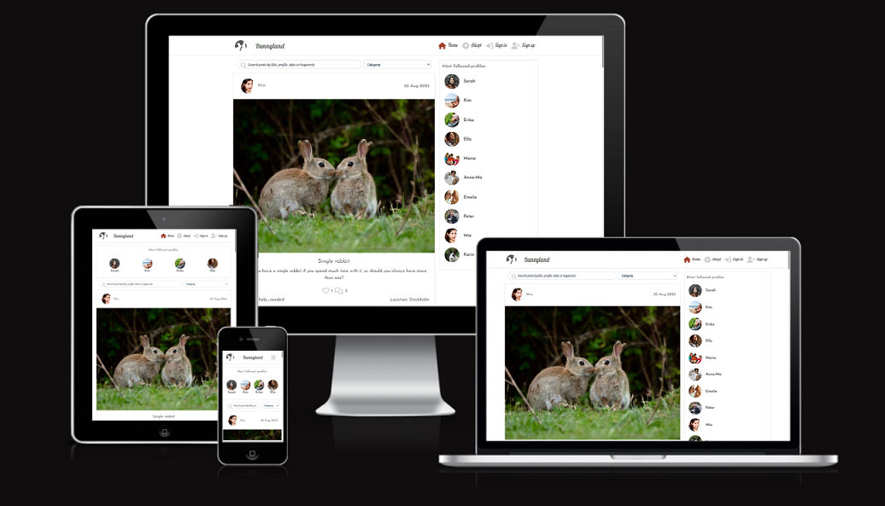

# **Bunnyland**

# Frontend Testing

## Table of Contents

* [**Testing**](<#testing>)
    * [Code Validation](<#code-validation>)
    * [Automatic Testing](<#automatic-testing>)
    * [Manual Testing](<#manual-testing>)
    * [Responsiveness Testing](<#responsiveness-testing>)
    * [Lighthouse Testing](<#lighthouse-testing>)
    * [Known Bugs](<#known-bugs>)

## Code Validation 

The Happening site has been passed through the [W3C html Validator](https://validator.w3.org/), the [W3C CSS Validator](https://jigsaw.w3.org/css-validator/) and the [ESLint Validator](https://eslint.org/docs/latest/use/getting-started#next-steps).

### W3C HTML Validation Results

No errors were found when the deployed Happening URL was passed through W3C HTML validation checker. Only some lines of info were noted regarding the standard Meta code in the index.html file. 

### W3C CSS Validation Results

No errors or warnings were found when the deployed Happening URL was passed through the W3C CSS Validation checker.

### ESLint Validation Results

After resolving the errors caused where files, by default, had react imported but not used, only 9 errors regarding the testing files, so I have left these, and subsequently uninstalled ES Lint as it was causing conflicts with the dependency tree. 

## Automatic Testing

The following Jest automatic tests have been written to check that the main frontend components render correctly: 

### NavBar.js
|  | | |
|:-------:|:--------|:--------|
| Renders Navbar Home link| &check; |
| Renders link to the feed page for a logged in user | &check; |
| Renders link to the liked page for a logged in user | &check; |

### NotFound.js
|  | | |
|:-------:|:--------|:--------|
| Go Back to homepage link renders | &check; |

### Avatar.js
|  | | |
|:-------:|:--------|:--------|
| Avatar renders | &check; |

### Event.js
|  | | |
|:-------:|:--------|:--------|
| Renders post component | &check; |
| Post owner avatar renders | &check; |

## Manual Testing

As well as the automatic tests, I carried out the following additional manual tests to check all the user story scenarios:

| Status | **Authentication - User Logged Out**
|:-------:|:--------|
| &check; | Typing 'https://bunnyland.herokuapp.com/feed' url into the browser, the user can not access the feed page. User is redirected Home
| &check; | Typing 'https://bunnyland.herokuapp.com' url into the browser, the user views the homepage posts feed
| &check; | Typing 'https://bunnyland.herokuapp.com/adoptionposts' url into the browser, the user views the adoption posts feed
| &check; | Typing 'https://bunnyland.herokuapp.com/posts/create' url into the browser, the user is redirected back to the homepage
| &check; | Typing 'https://bunnyland.herokuapp.com/profiles/{id}/edit' url into the browser, the user is redirected back to the homepage
| &check; | Typing 'https://bunnyland.com/events/{id}/edit' url into the browser, the user is redirected back to the homepage
| &check; | Desktop and tablet users can see an image next to the sign in form
| &check; | Mobile users can't see an image next to the sign in form
| &check; | Desktop and tablet users can see an image next to the sign up form
| &check; | Mobile users can't see an image next to the sign up form

| Status | **Navigation - User Logged Out**
|:-------:|:--------|
| &check; | Clicking the navbar brand logo loads the home page
| &check; | Clicking the Home button on the nav bar re-loads the home page
| &check; | Clicking the Adopt button on the nav bar re-loads the Adoption post page
| &check; | Clicking the Sign In button on the nav bar loads the sign up page
| &check; | Clicking the Sign Up button on the nav bar loads the sign in page
| &check; | The user can not see the profile page link in the navigation bar
| &check; | The user can not see the "Adoption request" button in the adoption posts
| &check; | The user can not see the sign out link in the navigation bar 
| &check; | Users can not see the Feed menu option in the navigation bar
| &check; | Users can not see the 'Add Post' button in the navigation bar
| &check; | Users can not see the 'Add Adoptionn post' button in the navigation bar
| &check; | Tablet and mobile users can see the navigation bar options in a burger menu dropdown
| &check; | Clicking a link from the navigation bar links automatically closes the burger menu
| &check; | User can not sign in with false credentials - warning message displayed
| &check; | User can not sign in without filling out all the input fields - warning message displayed
| &check; | User can not sign up without filling out all the input fields - warning message displayed
| &check; | User can not sign up if the two password fields don't match - warning message displayed
| &check; | User can not sign up if the username chosen already exists in the database - warning message displayed

| Status | **Homepage - User Logged Out**
|:-------:|:--------|
| &check; | Users can view the Popular Profiles component
| &check; | Users can not view the follow button under each Popular Profile
| &check; | Clicking on a popular profile avatar, users are redirected to the selected profile page
| &check; | Clicking on a Post, users are redirected to the selected Post detail page
| &check; | Clicking on a Adoption post, users are redirected to the selected Adoption post detail page
| &check; | Users can view all posts (title, description, category, location, image) 
| &check; | Users can view the likes count
| &check; | Users can view the comments 
| &check; | Users can view the comments count
| &check; | Clicking on an post comments count, users are redirected to the selected post detail page
| &check; | Clicking on an post owner avatar, users are redirected to the selected profile page
| &check; | Users can search for a particular post by typing in the post title, the username of the post owner, category, location, search word in the content

| Status | **Adoption post page - User Logged Out**
|:-------:|:--------|
| &check; | Users can view the Popular Profiles component
| &check; | Users can not view the follow button under each Popular Profile
| &check; | Clicking on a popular profile avatar, users are redirected to the selected profile page
| &check; | Clicking on a Adoption post, users are redirected to the selected Adoption post detail page
| &check; | Users can view all Adoption posts 
| &check; | Users can view the likes count
| &check; | Users can view the comments 
| &check; | Users can view the comments count
| &check; | Clicking on an post comments count, users are redirected to the selected Adoption post detail page
| &check; | Clicking on an post owner avatar, users are redirected to the selected profile page
| &check; | Users can search for a particular Adoption post by typing in the title, the username of the post owner, breed, age, sex, location, search word in the content

| Status | **Post Detail Page - User Logged Out**
|:-------:|:--------|
| &check; | Users can view the Popular Profiles component
| &check; | Clicking on a popular profile avatar, users are redirected to the selected profile page
| &check; | Clicking on a Post title, users are redirected to the selected Post detail page
| &check; | Users can view details of a single post
| &check; | Clicking on an Post owner avatar, users are redirected to the selected profile page
| &check; | Clicking on the like button, users are advised to login to like the post
| &check; | Users can view any published comments posted on a post
| &check; | Users can not see the create comment form

| Status | **Adoption post Detail Page - User Logged Out**
|:-------:|:--------|
| &check; | Users can view the Popular Profiles component
| &check; | Clicking on a popular profile avatar, users are redirected to the selected profile page
| &check; | Clicking on a Post title, users are redirected to the selected Adoption post detail page
| &check; | Users can view details of a single  adoption post
| &check; | Clicking on an Adoption post owner avatar, users are redirected to the selected profile page
| &check; | Clicking on the like button, users are advised to login to like the post
| &check; | Users can view any published comments posted on an Adoption post
| &check; | Users can not see the create comment form

| Status | **Profile Page - User Logged Out**
|:-------:|:--------|
| &check; | Users can view the Popular Profiles component
| &check; | Clicking on a popular profile avatar, users are redirected to the selected profile page
| &check; | Users can view the number of posts and adoption posts the profile owner has posted
| &check; | Users can view the number of followers the selected profile has
| &check; | Users can view the number of other profiles the selected profile is following
| &check; | Users can view the posts and adoption posts which were posted by the selected profile
| &check; | Clicking on the post image, users are redirected to the selected post detail page
| &check; | Clicking on a post comments count, users are redirected to the selected post detail page

| Status | **Navigation - User Logged In**
|:-------:|:--------|
| &check; | Clicking the navbar brand logo loads the home page
| &check; | Clicking the Home button on the nav bar re-loads the home page
| &check; | User can't see the sign in button in the navigation bar profile section dropdown menu
| &check; | User can't see the sign up button in the navigation bar profile section dropdown menu
| &check; | The user can see the profile page link in the navigation bar
| &check; | The user can see the sign out link in the navigation bar 
| &check; | Users can see the Feed menu option in the navigation bar
| &check; | Users can see the Adoption post link in the navigation bar
| &check; | Users can see the Liked link option in the navigation bar
| &check; | Users can see the 'Add Post' button in the navigation bar
| &check; | Users can see the 'Add Adoption post' button in the navigation bar
| &check; | Tablet and mobile users can see the navigation bar options in a burger menu dropdown
| &check; | Clicking a link from the navigation bar links automatically closes the burger menu
| &check; | User can view their avatar image next to the profile page link

| Status | **Homepage - User Logged In**
|:-------:|:--------|
| &check; | Users can view the Popular Profiles component
| &check; | Clicking on a popular profile avatar, users are redirected to the selected profile page
| &check; | Users can view the follow button under each Popular Profile
| &check; | Clicking on a popular profile follow button, users can become a follower of the selected profile
| &check; | Clicking on a Post title, users are redirected to the selected Post detail page
| &check; | Users can view all Posts posted to the site - title, description, category, location, image
| &check; | Users can view the likes count
| &check; | Users can view the comments count
| &check; | Clicking on a Post image, users are redirected to the selected Post detail page
| &check; | Clicking on the like button, likes count +1
| &check; | If the logged in user is the post owner, user can not click the like button - "You can´t like your own post" warning
| &check; | Clicking on an Post comments count, users are redirected to the selected Post detail page
| &check; | Clicking on an Post owner avatar, users are redirected to the selected profile page
| &check; | Users can search for a particular event by typing in the event title, the username of the event owner, the event date, or the event tag
| &check; | Users can search for a particular post by typing in the post title, the username of the post owner, category, location, search word in the content

| Status | **Add Post Page - User Logged In**
|:-------:|:--------|
| &check; | Users can view the empty form to create a new post
| &check; | Users can upload an image into the form
| &check; | Users can change an uploaded image
| &check; | Users can't submit the form without an image - warning message displayed
| &check; | Users can't submit the form without filling out the title  - warning message displayed

| Status | **Add Adoption post Page - User Logged In**
|:-------:|:--------|
| &check; | Users can view the empty form to create a new Adoption post
| &check; | Users can upload an image into the form
| &check; | Users can change an uploaded image
| &check; | Users can't submit the form without an image - warning message displayed
| &check; | Users can't submit the form without filling out the title  - warning message displayed

| Status | **Feed - User Logged In**
|:-------:|:--------|
| &check; | Users can view the Popular Profiles component
| &check; | Clicking on a popular profile avatar, users are redirected to the selected profile page
| &check; | Users can view the follow button under each Popular Profile
| &check; | Clicking on a popular profile follow button, users can become a follower of the selected profile
| &check; | Clicking on a Post title, users are redirected to the selected Post detail page
| &check; | Users can view all Posts posted by profiles they follow - title, description, event date, category, location, image
| &check; | Users can view the likes count
| &check; | Users can view the comments count
| &check; | Clicking on an Post image, users are redirected to the selected Post detail page
| &check; | Clicking on the like button, likes count goes up +1
| &check; | If the logged in user is the Post owner, user can not click the likes button - "You can´t like your own post" warning
| &check; | If the user clicks like, having previously clicked like, the like is unliked and count is -1
| &check; | Clicking on an Post comments count, users are redirected to the selected Post detail page
| &check; | Clicking on an Post owner avatar, users are redirected to the selected profile page
| &check; | Users can search for a particular post by typing in the post title, the username of the post owner, category, location, search word in the content

| Status | **Profile Page - User Logged In**
|:-------:|:--------|
| &check; | Users can view the Popular Profiles component
| &check; | Clicking on a popular profile avatar, users are redirected to the selected profile page
| &check; | Users can view the number of Posts and Adoptionposts the profile owner has posted
| &check; | Users can view the number of followers the selected profile has
| &check; | Users can view the number of other profiles the selected profile is following
| &check; | Users can view the Posts and Adoption posts which were posted by the selected profile
| &check; | Clicking on the Post image, users are redirected to the selected Post detail page
| &check; | Clicking on the Adoption post image, users are redirected to the selected Adption post detail page
| &check; | Clicking on the like button, likes goes up +1
| &check; | If the logged in user is the Post owner, user can not click the like button - "You can´t like your own post" warning
| &check; | If the user clicks like, having previously clicked like, the like is unliked and count is -1
| &check; | Clicking on a Post comments count, users are redirected to the selected Post detail page
| &check; | Clicking on a url in the contact details section will open the web page in a new browser tab.
| &check; | If the user is viewing their own profile page, they can see the three dots edit profile menu next to the profile stats
| &check; | Users can edit their own profile page via the three dots edit/delete menu
| &check; | On clicking edit profile, user is redirected to the edit profile page
| &check; | User can edit their own username via the three dots edit profile menu
| &check; | User can edit their own password via the three dots edit profile menu
| &check; | If the user is viewing their own profile page, they can view their personal messages inbox
| &check; | In the messages inbox, users can view all messages received by other users - sender username, date sent, and message content
| &check; | Clicking on the 'reply' button of a particular message, the user can send a reply message back to the original sender in a popup modal message form
| &check; | Users receive a success alert message when a reply has been successfully sent to another user
| &check; | If the user is viewing someone else's profile page, they can see a form to send that profile user a message
| &check; | Users can't send a blank message to another profile user - warning message displayed
| &check; | Users receive a success alert message when a message has been successfully sent to another user
| &check; | In the Adoption request inbox, users can view all Adoption requests received by other users - username, date, name, phone, email and message content

| Status | **Edit Profile Page - User Logged In**
|:-------:|:--------|
| &check; | Users can view the profile form pre-populated with the current profile details
| &check; | Users can upload an avatar image into the form
| &check; | Users can change the uploaded image
| &check; | Users can change the bio

## Responsiveness Testing

The responsive design tests were carried out manually throughout the build using Google Chrome Dev Tools. I based the main design around a desktop view, as this is primarily a browser based platform, although I have added responsive design for tablet and mobile devices as well. 

During the testing process I also used the [Responsive Design Checker](https://ui.dev/amiresponsive) website to simulate the website on several other devices. Here are my findings:

### Browser Compatibility 

Happening was tested on the following browsers:

- Google Chrome
- Microsoft Edge
- Mozilla Firefox

I do not have any Apple devices available to carry out testing on a Safari browser. Appearance and functionality appear to be consistent throughout all browsers. The site loads correctly on Firefox but it doesn't seem to be able to connect with the backend API and get the data. This is something I need to look at for the future to make sure that Firefox users can view my site.

## Lighthouse Testing

Google Lighthouse in Chrome Developer Tools was used to test the application within the areas of *Performance*, *Accessibility*, *Best Practices* and *SEO*. The testing showed the following:

* Home Page - Performance: 70, Accessibility: 95, Best Practises: 83, SEO: 100

### Peer Review

In addition to the above tests, I asked my peers to create a profile and interact with the site and their overall response was very positive and that this platform is something they would love to use on a day to day basis.

## Bugs Bugs

### Resolved

The following main Bugs were found during the development process:

 
### Unresolved

Please click [**_here_**](README.md) to return to the Happening README file.
